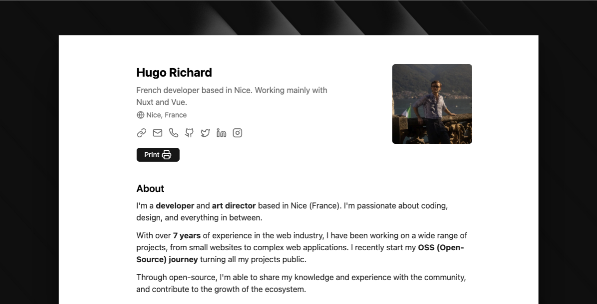
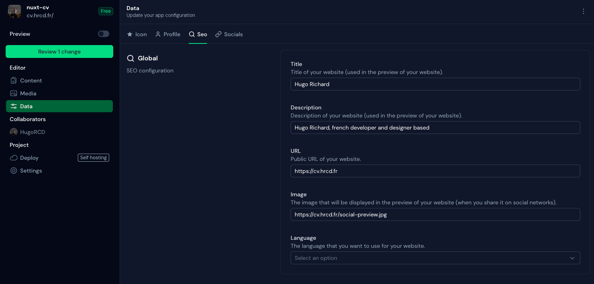

# Nuxt CV

Simple web app that renders minimalist CV with print-friendly layout.

Built with Nuxt and TailwindCSS v4.

## Live website

You can see it live at [cv.hrcd.fr](https://cv.hrcd.fr/).

# Features

- Fully integrated with [Nuxt Content](https://content.nuxt.com/), to be easily customizable
- Easy to customize
- Print-friendly layout



## Quick Setup

1. Clone this repository if you have access or download it from the store
```bash
git clone git@github.com:HugoRCD/nuxt-cv.git
```

2. Install dependencies
```bash
bun install
```

3. Start development server
```bash
bun dev
```

4. Generate static project
```bash
bun generate
```

5. Start production server
```bash
bun start
```

## How to modify the CV Content

This portfolio uses [Nuxt Content](https://content.nuxt.com/) to manage the content. Here's how you can modify it:

First check the `app.config.ts` file to change the global configuration of the portfolio, there is a lot of stuff you can change here.

### Works

1. Navigate to the `content/works/` directory.
2. Here, you'll find JSON files for each project. To modify an project, simply open its JSON file and make your changes.
3. To add a new project, add a new JSON file in this directory.

<!-- automd:fetch url="gh:hugorcd/markdown/main/src/contributions.md" -->

## Contributing
To start contributing, you can follow these steps:

1. First raise an issue to discuss the changes you would like to make.
2. Fork the repository.
3. Create a branch using conventional commits and the issue number as the branch name. For example, `feat/123` or `fix/456`.
4. Make changes following the local development steps.
5. Commit your changes following the [Conventional Commits](https://www.conventionalcommits.org/en/v1.0.0/) specification.
6. If your changes affect the code, run tests using `bun run test`.
7. Create a pull request following the [Pull Request Template](https://github.com/HugoRCD/markdown/blob/main/src/pull_request_template.md).
   - To be merged, the pull request must pass the tests/workflow and have at least one approval.
   - If your changes affect the documentation, make sure to update it.
   - If your changes affect the code, make sure to update the tests.
8. Wait for the maintainers to review your pull request.
9. Once approved, the pull request will be merged in the next release !

<!-- /automd -->

<!-- automd:fetch url="gh:hugorcd/markdown/main/src/local_development_dev.md" -->

<details>
  <summary>Local development</summary>

- Clone this repository
- Install latest LTS version of [Node.js](https://nodejs.org/en/)
- Enable [Corepack](https://github.com/nodejs/corepack) using `corepack enable`
- Install dependencies using `bun install`
- Start development server using `bun dev`
- Open [http://localhost:3000](http://localhost:3000) in your browser

</details>

<!-- /automd -->

<!-- automd:contributors license=Apache author=HugoRCD github="hugorcd/hr-folio" -->

Published under the [APACHE](https://github.com/hugorcd/hr-folio/blob/main/LICENSE) license.
Made by [@HugoRCD](https://github.com/HugoRCD) and [community](https://github.com/hugorcd/hr-folio/graphs/contributors) 💛
<br><br>
<a href="https://github.com/hugorcd/hr-folio/graphs/contributors">

</a>

<!-- /automd -->

<!-- automd:with-automd lastUpdate -->

---

_🤖 auto updated with [automd](https://automd.unjs.io) (last updated: Tue Oct 22 2024)_

<!-- /automd -->
